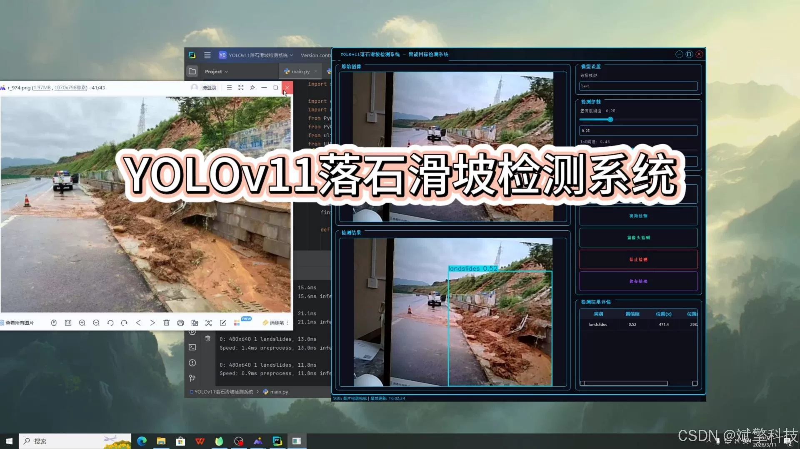
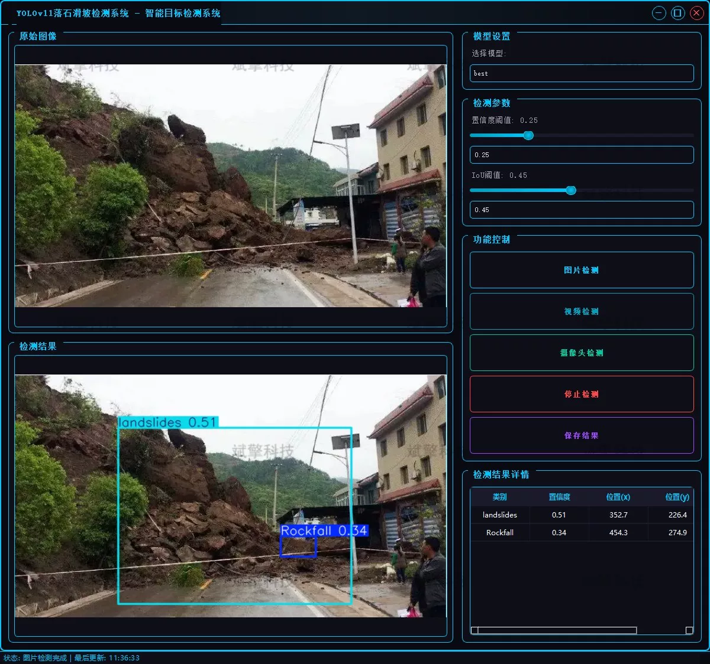
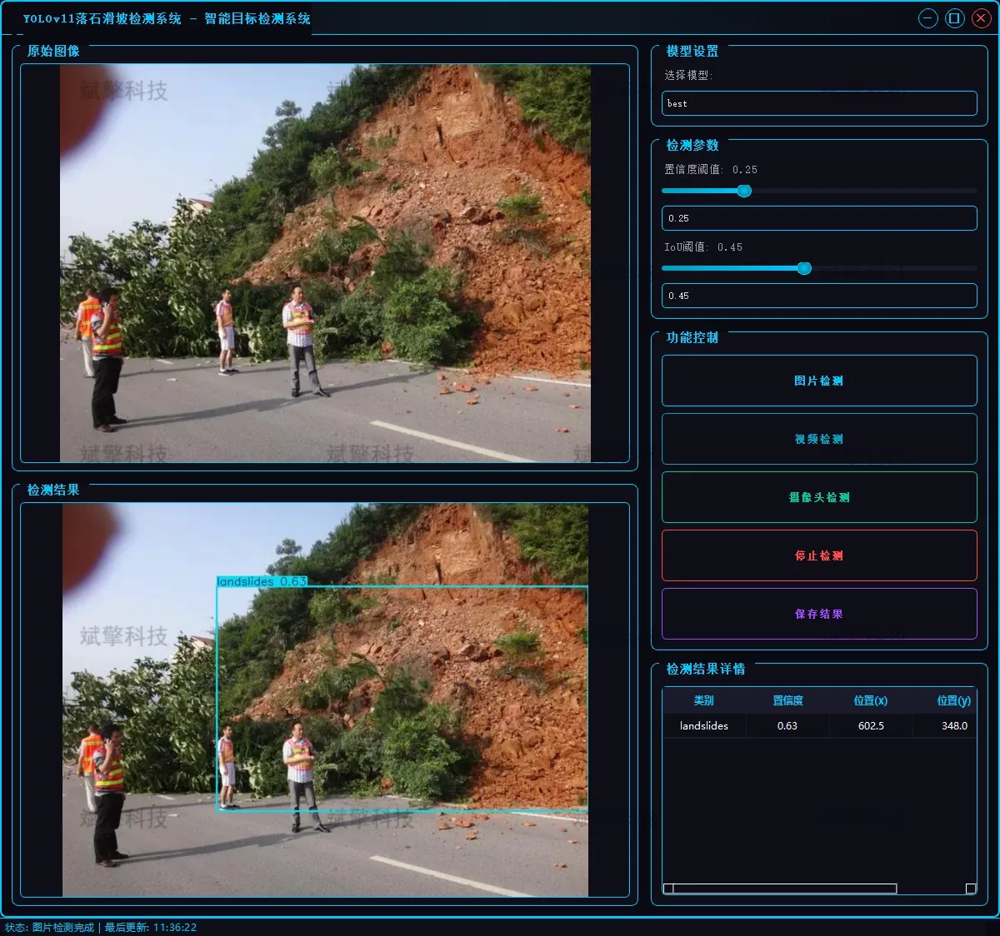

# YOLOv11 Landslide Detection System

## Body

YOLOv11 Landslide and Slope Detection System Based on YOLOv11 Deep Learning (YOLOv11+YOLO dataset + UI interface + login registration interface + Python project source code + model)

This project designs and implements a smart detection system for landslides and slopes based on the YOLOv11 deep learning algorithm.
The system utilizes the high precision and real-time performance advantages of YOLOv11 in the field of object detection. By training specialized recognition models for "landslide" and "slope" two types of disaster forms, it achieves automated parsing of multi-source inputs such as static images, video files, and real-time camera footage. The system can quickly identify geological disaster signs in the image and provide visual markers. It aims to provide efficient and precise technical support for geological monitoring, disaster warning, and emergency response.

Project Functionality Display

✅ User Login and Registration: Supports password verification and security validation.

✅ Three Detection Modes: Based on the YOLOv11 model, supports image, video, and real-time camera detection, accurately recognize targets.

✅ Dual Screen Comparison: Display original images and detection results on the same screen.

✅ Data Visualization: Real-time table displaying the category, confidence, and coordinates of detected targets.

✅ Intelligent Parameter Tuning: Offers a confidence slide bar to dynamically optimize detection accuracy, adapting to different scene needs.

✅ Sci-Fi Style Interactive Interface: Dark theme combined with dynamic light effects, reducing visual fatigue and enhancing operational experience.

✅ Multi-thread High-Performance Architecture: Independent detection threads ensure smooth operation, real-time status prompts, and rapid response without lag.

Dataset Introduction

Training Set (Training Set): 810 images.
Validation Set (Validation Set): 90 images.
Test Set (Test Set): 100 images.

## Images

## Payment

Here is a pay link on Stripe ( https://buy.stripe.com/3cs8yP7sY87d0vu9AB ). Please contact me lonlonago@foxmail.com after funding $89, and I will send you a complete data files , thank you!

